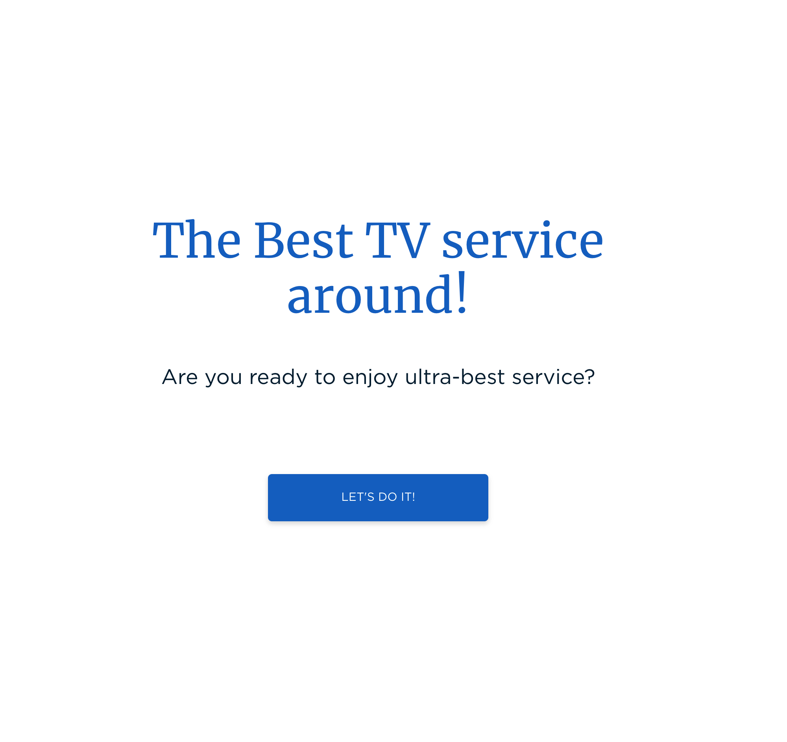
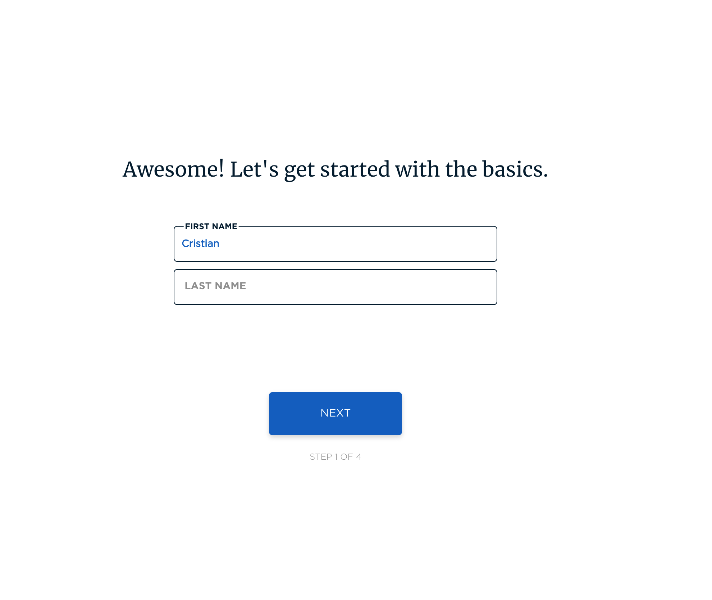
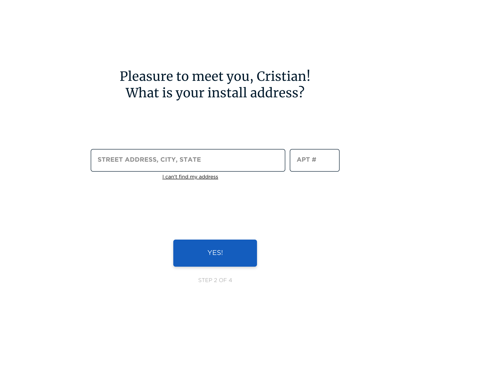
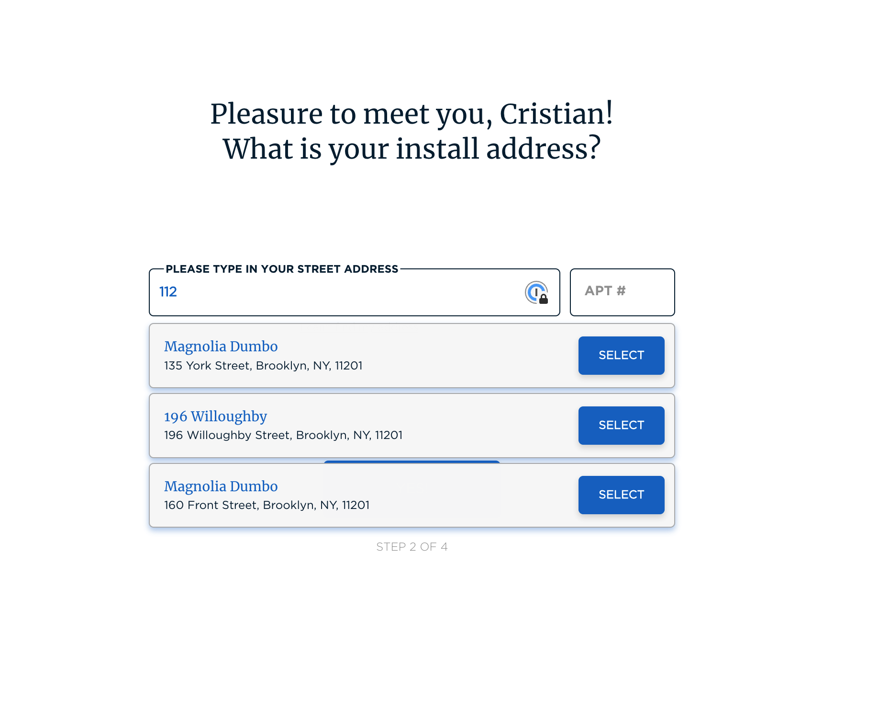
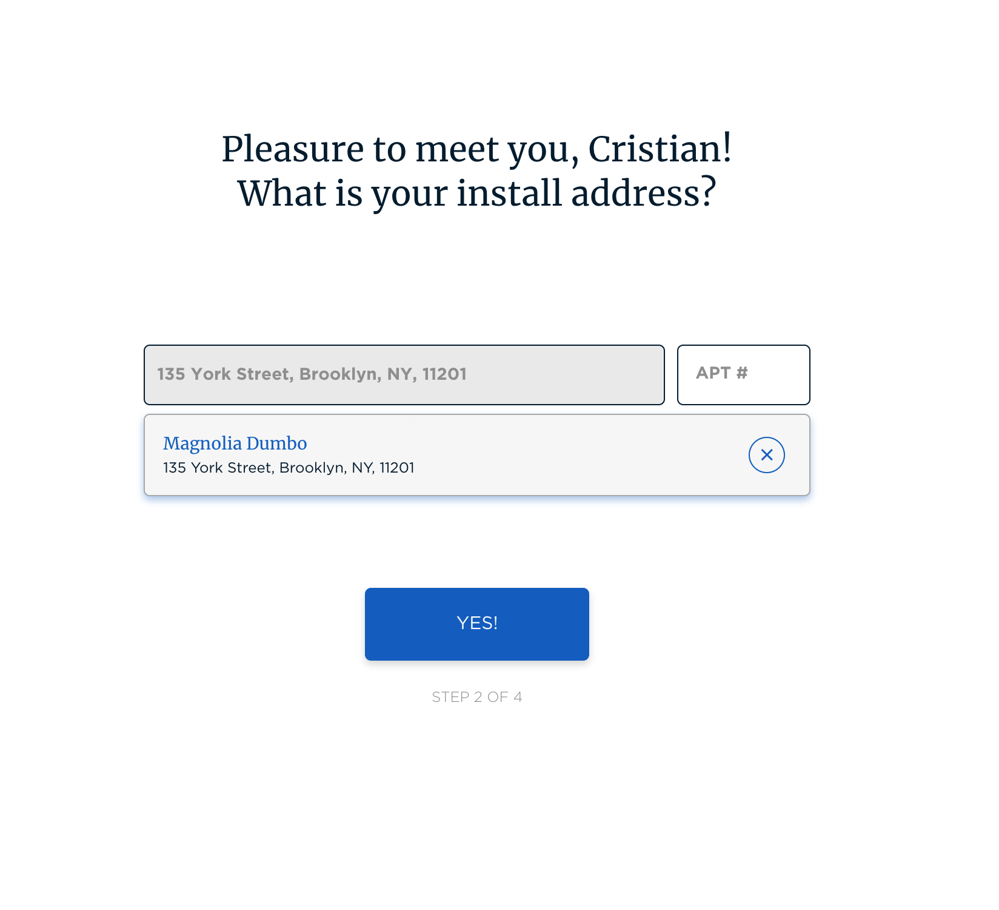
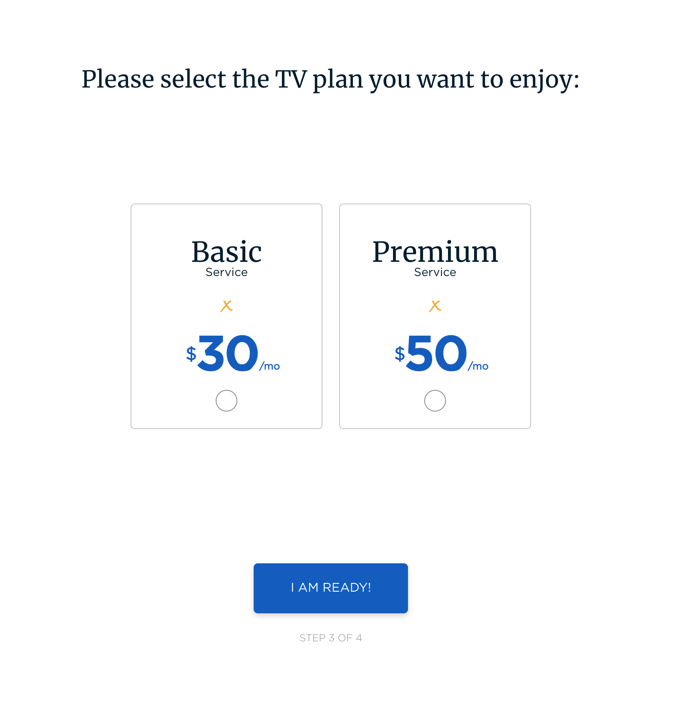
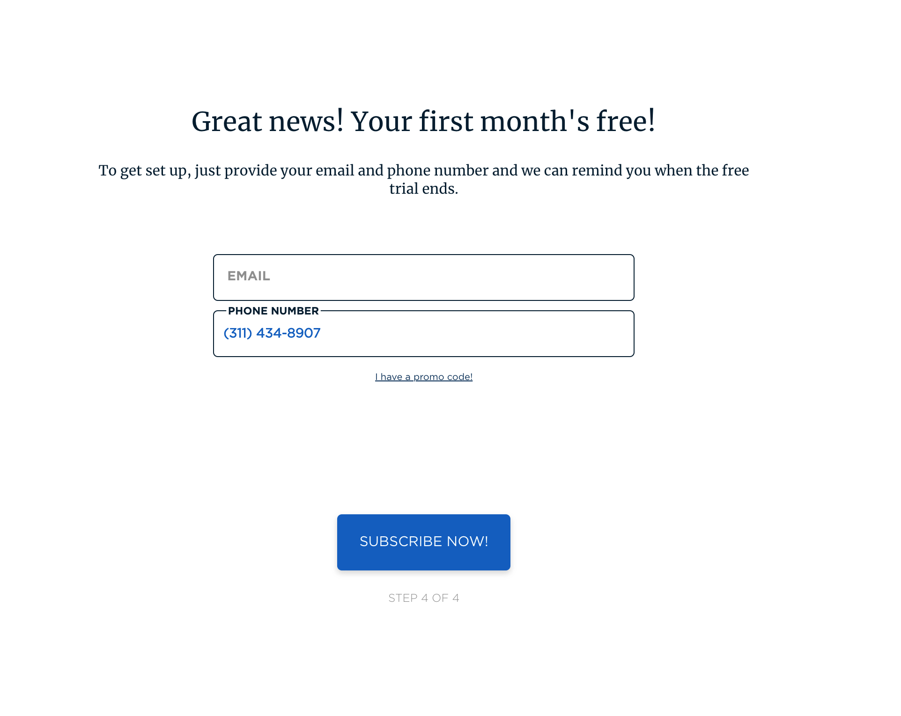

# MEGA TV Services

MEGA Services is a new platform to contract television services in a building. The main objective is to help users contract a cable TV service for their home.

To do so, the company has to create a new web application that allows users to register to find out if the building they live in currently has a cable TV system so they can purchase it.

## **What do you have to do?**

MEGA Services needs to implement an incredible web page where users can check if there is availability in their building to purchase a TV plan, in addition to being able to attract potential new customers with their respective residence address.

The Design team has sent us the new interface that needs to be implemented. As you can see, there are several steps to register the user.

- You will need to create a registration form, step by step, in which the application asks the user for the following information:
    - **Step 1:**
        - Welcome, you only have to have a button to start the process.
    - **Step 2:**
        - First and Last name
    - **Step 3:**
        - Address: It is a field that allows you to search and list the different buildings that we have in our database, these can be consulted by `name`, `city`, `address`, `zip code`, `state`.
        - Apt number
    - **Step 4:**
        - Select the TV plan
    - **Step 5:**
        - Email
        - Phone number
    - **Step 6:**
        - Thank you page

Here you could see the design of this process:

## **Technical Requirements**

Their Tech Lead has no time to implement that, but she has defined some technical constraints:

- This webapp has to be develop using React y Node.js
- Create an API to search the information of the buildings and register the customers information
- Create reusable components
- Create a **clean, maintainable and well-designed** code
- Test your code until you are comfortable with that

## Technologies

There are some restrictions on the technology to be used:

- Structure the app as a **Single Page web Application**, React.
    - Bonus points: Use **redux** or **context**
- We prefer **MongoDB** to be the **database** (you can [create a free account here](https://www.mongodb.com/es/cloud/atlas/register)), but you can use another one if you want.
- Use SCSS or SASS to manage your stylesheets

### **Considerations**

- To obtain the data of the buildings, you must **create an API in Node.js** that returns the information of **[this file](./assets/buildings.json)**, when searching for any of its fields (name, address, state, city, etc).
- We are looking for a Mobile First design
- Pay attention to the design
- The backend app exposes a **REST API** that is the way in which the frontend app communicates with the backend
- The backend app is separated into layers, modules(e.g., Controllers, Models, etc). We prefer the [domain folder structure](https://alexkondov.com/tao-of-node/#structure-in-modules)
- The whole project must be in the **same repository** and will contain the react application inside the `client` folder and the backend in the `server` folder

To understand how you take decisions during the implementation, please write a README file explaining some of the most important parts of the application.

---

## **How to submit your solution**

- Push your code to the `devel` branch - we encourage you to commit regularly to show your thinking process was.
- **Create a new Pull Request** to `main` branch & **merge it**.

Once merged you **won't be able to change or add** anything to your solution, so double-check that everything is as you expected!

Remember that **there is no countdown**, so take your time and implement a solution that you are proud!
